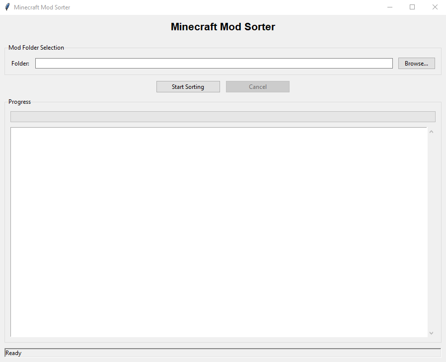

# Minecraft Mod Sorter

Automatically sort Minecraft mods into client-only, server-only, and both using the Modrinth API.
This tool could be very useful if you are setting up a Minecraft server and want to prevent server-side mods from running on the client and client-side mods from running on the server.

   

## Requirements

- Python 3.6+
- Internet connection :D

## How It Works

The tool scans your mods folder and uses Modrinth's API to determine where each mod should be installed:

- **client-only/**
- **server-only/**
- **both/**
- **unknown/** - Not found on Modrinth

## Output

Creates a `sorted_mods` folder with your mods organized into the categories above. Original files are unchanged.

## Notes

- Uses SHA1/SHA512 hashes for identification
- Adds delays between API calls to be respectful
- Mods not on Modrinth go in "unknown" folder

## License

MIT License - see [LICENSE](LICENSE) file.

## Credits

Uses the [Modrinth API](https://docs.modrinth.com/)
